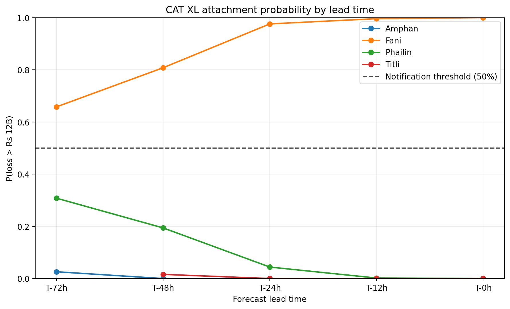
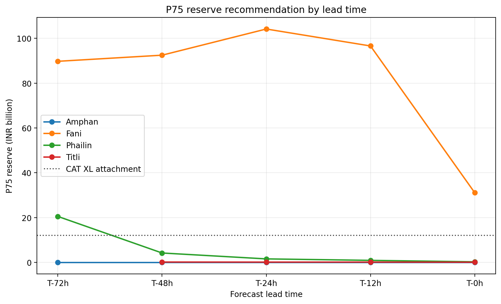

# Cyclone Event Response - Forecast Uncertainty and the Decision Clock

Project 3 of three on catastrophe risk for the coastal Odisha belt. Project 1 built the risk view, Project 2 built the exposure it runs on, and this project runs that view forward in time under the forecast uncertainty an event response team actually faces.

**Stack:** Python 3.11 · CLIMADA 6.1.0 · IBTrACS · IMD RSMC verification statistics · NumPy/SciPy · pandas · GeoPandas · Shapely · pyproj · xarray · Matplotlib · Cartopy

---

## Headline finding

> **The level of modelled attachment probability does not separate a real threat from a false alarm at long lead. The direction of travel does.**
>
> At 72 hours before landfall, Fani sits at a 65.8% chance of breaching the reinsurance attachment point and Phailin at 30.8%. Those are not confidently distinguishable numbers for a team deciding whether to mobilise. By 24 hours they are 97.6% and 4.4%. Across all 19 runnable event-lead panels, attachment probability rises monotonically for the one event that struck the portfolio and falls monotonically for the three that did not, with no reversal anywhere.
>
> The decision-relevant signal is therefore the slope of the probability against lead time, not its value at any single issue. Reading the level alone at T-72h would have mobilised for Phailin.
>
> Two reasonable rules disagree at T-72h. Phailin's attachment probability of 0.308 keeps the notification trigger silent, while its 75th-percentile reserve of ₹20.51B sits above the ₹12B attachment point. The rule that reads the whole distribution and the rule that reads one quantile of it give opposite answers for the same storm. A quarter of Phailin's T-72h members also exhaust the full ₹10B limit.

A second finding follows from the same runs. Forecast uncertainty does not merely widen the loss distribution, it **biases the reserve upward**. Fani's 75th-percentile reserve peaks at ₹104.16B at T-24h against a realised T-0 median loss of ₹28.34B, a factor of **3.68**. The reserve a team would actually have posted at the moment of maximum apparent danger was nearly four times what the event cost.

---

## Results at a glance

| Metric | Value | Note |
|---|---|---|
| Events modelled | 4 | Fani 2019, Phailin 2013, Titli 2018, Amphan 2020 |
| Forecast lead times | 72, 48, 24, 12, 0 h | T-0 is analysis uncertainty, not a forecast |
| Event-lead panels | **19 of 20 runnable** | Titli T-72h is unavailable, and that is a result ⚠ |
| Ensemble members per panel | 500 | one persistent draw triple per member |
| Wind fields computed | **9,500** | CLIMADA `TropCyclone`, 525-cell P1 grid |
| Loss files produced | 95 | 19 panels × 5 Project 2 exposure scenarios |
| Modelled portfolio | **₹145.684B** TIV | Project 2 PRIMARY accumulation, 17 of 525 cells occupied |
| CAT XL layer | **₹10B xs ₹12B** | rescaled from Project 1 at constant share of exposure |
| Trigger result | 1 warned hit, 0 missed, 0 false alarms | at any threshold in 0.35 to 0.65 |
| Warning lead achieved | **72 h** | the full length of the experiment |
| Maximum modelled loss | ₹140.44B | 96.4% of portfolio TIV, see limitations ⚠ |

### Attachment probability, the project's central result

P(gross loss > ₹12B attachment), 500 members per cell.

| Event | T-72h | T-48h | T-24h | T-12h | T-0h | Struck portfolio |
|---|---|---|---|---|---|---|
| **Fani** | 0.658 | 0.808 | 0.976 | 0.996 | **1.000** | yes |
| **Phailin** | 0.308 | 0.194 | 0.044 | 0.002 | 0.000 | no |
| **Titli** | unavailable | 0.016 | 0.000 | 0.000 | 0.000 | no |
| **Amphan** | 0.026 | 0.000 | 0.000 | 0.000 | 0.000 | no |



*Figure 1. Probability that gross loss exceeds the ₹12B attachment point, by forecast lead time, 500 members per point. Fani rises from 0.658 to 1.000 and sits above the 50% notification threshold at every lead. The three events that missed the portfolio fall monotonically towards zero. At T-72h the gap between Fani and Phailin is 0.658 against 0.308, which is not a confident separation; by T-24h it is 0.976 against 0.044. The information arrives as the slope, not the level.*

Monotone in both directions, 19 panels, no exceptions.

### The reserve a team would have posted

75th-percentile gross loss, against Fani's realised T-0 median of ₹28.34B.

| Lead | Reserve (P75) | Multiple of realised | Mean loss |
|---|---|---|---|
| T-72h | ₹89.74B | 3.17x | ₹47.11B |
| T-48h | ₹92.47B | 3.26x | ₹56.36B |
| T-24h | **₹104.16B** | **3.68x** | ₹78.45B |
| T-12h | ₹96.59B | 3.41x | ₹78.76B |
| T-0h | ₹31.11B | 1.10x | ₹28.49B |



*Figure 2. The 75th-percentile reserve a team would have posted at each lead, against the ₹12B attachment point. Fani's reserve peaks at ₹104.16B at T-24h and collapses to ₹31.11B once the track is known, a factor of 3.35 between the worst reserve and the realised one. Phailin's reserve at T-72h is ₹20.51B, above the attachment point, for a storm that caused ₹0.235B: on a reserve basis alone, Phailin looked like an attaching event three days out.*

The peak is at T-24h rather than T-72h. Uncertainty is largest at T-72h, but at that range a large share of members miss the portfolio entirely and contribute zero, which holds the upper percentiles down. The worst reserve is posted when the storm is close enough that most members hit and still uncertain enough that placement varies.

---

## The decision clock

The project is organised around a single question: at each point on the clock, what did the forecast actually support?

| Lead | What is known | Position error (DPE) | Landfall point error (LPE) | Phase |
|---|---|---|---|---|
| T-120h, T-96h | little; samples too small to use | 245.2 km, 182.7 km | not published | rejected, see below |
| T-72h | a basin and a rough corridor | 154.0 km | 69.5 km | cone |
| T-48h | a stretch of coast | 110.9 km | 39.3 km | cone |
| T-24h | a landfall region | 72.0 km | 16.2 km | commitment |
| T-12h | a landfall point | 44.9 km | 10.5 km | commitment |
| T-0h | the analysis | 5.0 km (assumed) | 5.0 km (assumed) | realisation |

Every figure in the two error columns is a sample-weighted multi-year mean of IMD RSMC New Delhi verification statistics, reproduced against IMD's own published means as a check. The derivation, the provenance tag on each number, and the twelve executable assertions that guard them are in [`docs/FORECAST_ERROR_MODEL.md`](docs/FORECAST_ERROR_MODEL.md).

**96h and 120h are excluded from the loss phase deliberately.** IMD publishes landfall verification for 10 to 24 storms per lead at 12 to 72h but nothing usable beyond that, and the track figures at 96h and 120h rest on 55 and 28 cases. More importantly, a storm verified at 120h lead is one that survived long enough to be verified, which is a selection effect, not a forecast skill statement. Extrapolating the ladder there would have produced confident numbers from no data.

**T-0 is an assumption, and it is labelled as one.** IMD publishes no analysis-position uncertainty, so 5.0 km is adopted and tagged `assumed` throughout, with the reasoning recorded. It is isotropic because analysis uncertainty has no preferred direction, unlike forecast error.

---

## Method

### 1. Landfall definition

Every downstream quantity depends on when and where each storm made landfall, and the four events had to be treated identically. Three candidate definitions were tested and the geometric one was adopted:

**Landfall is the first sea-to-land crossing of the interpolated best track against the Natural Earth 10m coastline, resolved to the minute.**

| Event | IBTrACS SID | Landfall (UTC) | Latitude | Longitude | IMD reference | Offset |
|---|---|---|---|---|---|---|
| Fani | 2019116N02090 | 2019-05-03 03:51:27 | 19.765304 N | 85.756775 E | 2019-05-03 03:30 | -21 min |
| Phailin | 2013281N12098 | 2013-10-12 16:25:09 | 19.288445 N | 84.954138 E | 2013-10-12 17:00 | -35 min |
| Titli | 2018281N14088 | 2018-10-10 22:34:26 | 18.613110 N | 84.388326 E | 2018-10-10 23:30 | -56 min |
| Amphan | 2020136N10088 | 2020-05-20 10:42:54 | 21.814257 N | 88.198464 E | 2020-05-20 11:00 | -17 min |

All four land within 60 minutes of the IMD reference, which is used as validation
rather than as the definition. Where IMD published a landfall window the midpoint
is taken; where it published a single time, that time is used directly.

### 2. Forecast error model

IMD verification statistics are reduced to two sampler ladders. Position error magnitude in two dimensions is Rayleigh-distributed, so σ = 0.798 × DPE. Landfall point error is a one-dimensional coastal displacement, so σ_c = 1.253 × LPE. Those two conversions are reciprocal and 36% apart, and using the wrong one is the kind of error that produces a plausible table.

Anisotropy is then derived rather than assumed. Published DPE and LPE at the same lead jointly constrain the along-track and cross-track widths through the Hoyt distribution, solved numerically with Gauss-Legendre angular quadrature:

| Lead | σ_a (along, km) | σ_c (cross, km) | σ_a / σ_c |
|---|---|---|---|
| 0 h | 3.99 | 3.99 | 1.00 |
| 12 h | 52.40 | 13.20 | 3.97 |
| 24 h | 84.47 | 20.29 | 4.16 |
| 48 h | 120.25 | 49.28 | 2.44 |
| 72 h | 154.00 | 87.13 | 1.77 |

Along-track error is timing error. Cross-track error is landfall placement. At 24h the forecast knows where a storm will come ashore four times better than it knows when.

### 3. Ensemble generation

Each member draws three standard normal deviates once, `z_a`, `z_c` and `z_v`, and carries them for the whole forecast:

```
for each horizon h in [0, T]:
    along(h) = sigma_a(h) * z_a
    cross(h) = sigma_c(h) * z_c
    rotate (along, cross) into the track frame, displace geodesically
```

Correlation along the track is 1 by construction and the displacement grows as σ grows. The alternative of drawing independently at each horizon was rejected: it produces members that wander across the corridor rather than tracks that are consistently left or right of forecast, which is not what forecast error looks like.

The track frame is anchored on the **landfall heading** rather than the instantaneous heading. The local-heading version rotates the frame as the storm turns, which swings the displaced position about a lever arm and produced 144 of 500 physically impossible members for Phailin at T-72h, with implied translation speeds of 407 km/h. The landfall-anchored frame gives 0 of 500 and 24 km/h.

Each ensemble track continues **past landfall** by enough real best-track path length to cover 4σ_a of backward displacement, so that a member displaced backward in time still reaches the coast. This was not in the original design and the reason it is there now is in the defects section.


*Figure 4. Fani's gross loss distribution at each lead. The mean and median rise towards T-24h and T-12h before collapsing at T-0h, because at long lead a substantial share of members miss the portfolio and contribute zero, which pulls the central estimate down. The widest P5 to P95 band is at T-72h at ₹133.42B, against ₹13.60B at T-0h.*

### 4. Hazard

CLIMADA `TropCyclone.from_tracks` on Project 1's exact 525-cell grid, bounds 82 to 88 E and 17 to 22 N, with WGS84 geodesic distance-to-coast computed against the Natural Earth 10m coastline rather than via the NASA dataset CLIMADA would otherwise fetch. 19 panels × 500 members = 9,500 wind fields, at 11.2 s per panel.

### 5. Exposure

Project 2's PRIMARY accumulation portfolio, ₹145.684B of TIV, aggregated from 5,000 synthetic point locations onto Project 1's grid. **17 of 525 cells are occupied.** 


*Figure 3. The 17 occupied cells of Project 2's PRIMARY portfolio, with the four geometric landfall points. The block shape is the artefact: Project 2 generated its synthetic locations uniformly inside a rectangle rather than along the coast, so the southern boundary is a property of the rectangle. Only the two southernmost cells sit near the coastline. Fani comes ashore at the block's southeastern edge, Phailin roughly 60 km southwest along the coast, Titli far to the southwest and Amphan far to the northeast. The spread from direct strike to clean miss is what makes the discrimination result possible, and it is a property of the portfolio as much as of the storms.*

All five Project 2 scenarios are carried through so the exposure-quality axis can be compared against the meteorological one.

### 6. Loss

Project 1's Odisha OSDMA vulnerability curve, id 2, verified point by point against the Project 1 implementation on every run. Using a different curve would have made P3 losses incomparable with P1's and undermined the layer rescaling in the next step.

### 7. Reinsurance structure

Project 1 prices $10B xs $12B on a $144.86B USD exposure base. Project 3 computes losses in rupees on a ₹145.684B portfolio. **The layer is not copied across as a number.** It is rescaled to the same share of exposure:

```
attachment share = 12.00 / 144.86 = 8.284%  ->  Rs 12.07B, quoted as Rs 12B
limit share      = 10.00 / 144.86 = 6.903%  ->  Rs 10.06B, quoted as Rs 10B
```

The derivation is written out in `config.py` rather than asserted because the two portfolio magnitudes, 144.86 and 145.684, are within 0.6% of each other in different currencies. A naive currency copy would have produced roughly the same figures, so the arithmetic has to be visible for a reader to tell the two apart.

### 8. Decision layer, frozen before the runs

| Rule | Value |
|---|---|
| Reserve | 75th percentile of gross loss |
| Notification | P(attach) ≥ 0.50 |
| Recovery | min(max(loss - attachment, 0), limit) |

These were fixed in `config.py` before any loss was computed. The threshold sweep in Stage 8 later showed that a 0.50 threshold sits in the middle of the plateau from 0.35 to 0.65 over which the trigger is perfect on this sample. That is a validation of a pre-registered choice, not a fitted one.

### 9. Variance decomposition and trigger backtest

First-order variance indices, η² with bias-corrected ω² and a Spearman cross-check, computed against the latent draws reconstructed exactly from the seed. Then a threshold sweep scoring warning lead against false alarms.


*Figure 5. Notification threshold swept from 0.05 to 0.95. Below 0.35 Phailin becomes a false alarm; from 0.35 to 0.65 the trigger is perfect on this sample with the full 72 hours of warning; above 0.65 warning lead erodes to 48 and then 24 hours. The 0.50 rule was frozen before any loss was computed and sits in the middle of that plateau. With one hit and three misses, the plateau is a property of this four-event sample and nothing more.*

---

## Validation and checks performed

- **IMD means reproduced.** Sample-weighted multi-year means recompute IMD's own published figures before any of them are used.
- **Sampler calibration asserted, not assumed.** The ensemble's sampled landfall spread is checked against the published LPE and its total position spread against the published DPE, at every lead, with tolerances derived from the Monte Carlo standard error at N = 500 rather than chosen as round numbers.
- **Dimension-aware landfall check.** At 12 to 72h the published landfall figure is a 1-D coastal displacement and is compared against the cross-track component alone. At T-0 it is a 2-D isotropic position uncertainty and is compared against the magnitude. Comparing the T-0 figure against the cross component alone would expect 5.0 km from a quantity whose mean is 3.19 km, and would fail a sampler behaving exactly as specified.
- **Equal-sigma Rayleigh limit.** When σ_a is forced equal to σ_c the anisotropic solver must reduce to the isotropic Rayleigh result. This assertion is what caught a dropped Jacobian factor in the angular integral, described below.
- **Geometry round trip.** Every member's applied offset is recovered from the resulting coordinates by inverse geodesic, which guards the heading convention and would catch a left/right or along/cross swap.
- **Persistence through the sampler.** Correlation between offsets at the first and last horizon must be 1. An earlier version of this check compared `c1*z_a` against `c2*z_a`, which is 1 by algebra regardless of the sampler, and a deliberately broken sampler passed it. It was replaced with three checks that run through the real code path.
- **Member order verified.** Stage 7 joins losses to latent draws by index, so the generator's source is inspected to confirm the draw order has not changed. A reordered draw would still produce a plausible decomposition of the wrong variables.
- **Stage 5 and 6 recomputed from raw losses.** All quantiles, means, reserves and attachment counts in the committed summaries were independently recomputed from the 9,500 member losses and agree exactly.
- **Extension coverage asserted.** For every positive-lead panel, the post-landfall extension is compared against the largest backward displacement actually drawn. See [`outputs/extension_coverage.csv`](outputs/extension_coverage.csv).
- **T-0 panels bit-identical across the fix.** The five T-0 panels are the only ones that receive no extension, and their loss variances are identical to the last digit before and after the change, which confirms the fix altered nothing it should not have.

---

## Defects found and fixed

Two of these were found by assertions, and the third was found only because a diagnostic was written for something else. All three are documented rather than quietly corrected.

### Post-landfall truncation, the serious one

The ensemble specification places each member at horizons 0 to T, where T is landfall. Implemented literally, the track array **ends at landfall**. A member displaced backward along track therefore had every position offshore, CLIMADA computed a wind field that never came ashore, and the loss was exactly zero.

That zero is indistinguishable in a loss file from a member that made landfall too far away to cause damage. The two have opposite meaning: one is a statement about forecast uncertainty, the other about the length of an array.

They are distinguishable in the latent draws. Cross-track displacement does not depend on `z_a` at all, so a genuine miss is symmetric in `z_a`. Truncation affects only backward displacements, so it is one-sided. Reconstructing the draws from the seed and testing the sign balance of `z_a` among zero-loss members gave:

| Event | Leads tested | Fraction of zeros with z_a < 0 | Deviation from symmetric |
|---|---|---|---|
| Fani | 72, 48, 24, 12 | 0.948, **1.000**, **1.000**, **1.000** | 11.1, 11.7, 7.1, 5.2 σ |
| Phailin | 72, 48, 24, 12 | 0.882, 0.916, 0.990, **1.000** | 11.8, 12.5, 13.7, 11.4 σ |
| Titli | 48, 24, 12, 0 | 0.589, 0.679, 0.582, 0.631 | 3.3, 6.5, 2.9, 3.2 σ |
| Amphan | 72, 48 | 0.479, 0.516 | 0.9, 0.7 σ |

Four panels at exactly 1.000. Amphan is the control: symmetric in `z_a`, and the mean \|z_c\| of its zero-loss members is 0.64 against 1.44 for its loss-producing members, which is the correct signature for a storm that can only reach the portfolio through a large cross-track displacement.

The fix extends each track past landfall by 4σ_a of real best-track path length, with σ held constant over the extension so the post-landfall segment is a rigid translation by the member's landfall offset. Zero counts after the fix:

| Panel | zeros before | zeros after |
|---|---|---|
| Fani T-72h | 154 | 53 |
| Fani T-48h | 137 | 15 |
| Fani T-24h | 50 | 1 |
| Fani T-12h | 27 | **0** |
| Phailin T-12h | 131 | 36 |

Every Stage 4 to Stage 9 output was regenerated. The superseded diagnostic is kept at [`outputs/zero_loss_mechanism_PRE_FIX.csv`](outputs/zero_loss_mechanism_PRE_FIX.csv) alongside the current one, because the pair is the evidence.

**The sign test is a screen, not a verdict.** One-sidedness is necessary for truncation but not sufficient. Along-track displacement is a real displacement, so where a storm's direction of motion points towards the portfolio, forward and backward shifts have genuinely different loss consequences and the zeros are one-sided for physical reasons. Phailin, which made landfall moving northwest up the coast towards the exposure block, is exactly that case, and its residual one-sidedness after the fix is geometry. The test that is not confounded compares each panel's extension length against the largest backward displacement drawn, and 14 of 15 positive-lead panels are fully covered.

### A dropped Jacobian in the anisotropy solver

The angular integral for the Hoyt magnitude lost one power of r. The solver converged, the constraints appeared satisfied, and the resulting table looked reasonable, with σ_a inflated by roughly 25%. The only visible symptom was an implied translation speed of 30 km/h, above the plausible range for these storms, which was initially explained away rather than treated as a signal. The equal-sigma Rayleigh-limit assertion now catches it in under a second.

### Pooled statistics computed on means

An early version derived the along-track width as √(DPE² - LPE²) applied to the published means. Expected magnitudes do not combine in quadrature, only variances do. Replaced with a joint numerical calibration that solves for σ_a and σ_c such that the sampler reproduces both published quantities simultaneously.

---

## What I rejected, and why

- **96h and 120h lead times in the loss phase.** Published verification rests on 55 and 28 cases, no landfall statistics exist at all, and the surviving-storm selection effect makes those figures a statement about which storms lasted rather than about forecast skill.
- **Clamping Titli's T-72h origin forward by 1.43 h.** It would have made Titli's "T-72h" actually T-70.6h, so the panels would stop being comparable and the landfall calibration assertion would have no ladder entry to check against. The panel is reported unavailable instead, with its shortfall recorded in [`outputs/track_availability.csv`](outputs/track_availability.csv). Titli's best track begins 70.57 h before landfall, so an event response team at T-72h had nothing to respond to. That is the finding.
- **IMD's stated landfall times as the definition.** Event-dependent, because IMD publishes a window for some storms and a point for others.
- **Instantaneous track heading for the perturbation frame.** Produces a lever-arm artefact and 28.8% physically impossible members on Phailin T-72h.
- **Independent draws at each forecast horizon.** Produces wandering tracks rather than consistently displaced ones.
- **Intensity MAE as the sampler width.** MAE understates the second moment; RMSE is the quantity a Gaussian sampler needs. The two differ by a factor of about 1.5 at 12h, and more at longer leads.
- **A chosen Monte Carlo tolerance.** Every tolerance is derived from N. A tolerance picked as a round number is how a correct sampler gets debugged for a day.

---

## Known limitations

- **Absolute loss is not calibrated, and the maximum is not credible.** Project 1 modelled Fani at $46.91B against substantially lower published estimates and flagged its exposure-to-vulnerability transfer as uncalibrated for absolute loss. Project 3 inherits that whole. The clearest symptom is here: the maximum modelled loss of ₹140.44B is **96.4% of portfolio TIV**, a mean damage ratio no real book would sustain. **The defensible claims in this project are therefore relative:** how the loss distribution moves with lead time, and where attachment probability crosses a threshold. Both are ratios and both survive an uncalibrated severity scale. No rupee figure here should be read as a loss estimate.
- **The portfolio footprint is a bounding-box artefact.** Project 2 generated its 5,000 synthetic locations uniformly inside a rectangle over coastal Odisha rather than along the coastline, so the occupied cells form a block rather than a coastal strip, and the block's southern edge is a property of the rectangle rather than of insured exposure. Three of the four events make landfall outside it. The discrimination result is therefore partly a consequence of portfolio geometry and is not a general statement about how often an Odisha cyclone threatens a coastal book. A coast-following portfolio would place Phailin and Titli within damaging range and would likely give a less clean separation.
- **The trigger backtest has one hit.** One warned hit, three correct silences, and a zero false alarm rate on a sample of four events. The 0.35 to 0.65 plateau is indicative of nothing beyond this sample. A real backtest needs tens of events.
- **Wind peril only.** Storm surge and rainfall flooding are excluded and were major loss contributors for Phailin, Fani and Yaas. Project 1 calls this its largest scope limitation and it applies unchanged here.
- **Exposure is synthetic.** Project 2's portfolio is a constructed test set, not a real book. Its total was calibrated to be plausible, not actual.
- **One member of 500 is still truncated.** Phailin T-72h drew a member displaced 463 km backward against the 422 km extension that its best-track record can supply; the record ends 19 h after landfall and no longer extension exists. The effect is bounded: that panel's zero fraction is overstated by 0.002 and its attachment probability understated by at most 0.002, each about a tenth of the Monte Carlo standard error at N = 500, and its mean loss is understated by at most 1.6%. Three further panels fall short of the 4σ target (Amphan T-72h at 3.96σ, Phailin T-48h at 3.51σ, Titli T-48h at 3.23σ) but no member in any of them exceeded the extension provided.
- **Nearest-coastline selection is done in degree space.** Distance-to-coast picks the nearest Natural Earth segment using planar distance on unprojected coordinates, then computes the distance to it geodesically. The returned distance is correct; the choice of segment is approximate. At 17 to 22 N the two agree, but the code emits a GeoPandas warning per centroid that should not be mistaken for a defect.
- **Relative loss width is unstable where the median is near zero.** Phailin's relative width peaks at T-48h rather than T-72h because it divides by a median of ₹0.37B. The absolute width collapses monotonically for all four events. Read `p_zero_loss` alongside the width columns rather than the ratio alone.
- **Forecast error is a historical climatology, not a per-event forecast.** The sampler uses multi-year IMD mean error for each lead. It does not know that a particular storm was unusually well or badly forecast, and it carries no information about forecaster confidence on the day.
- **Interaction is unattributed.** First-order indices explain 85 to 95% of the loss variance for the direct hit but under half for the marginal events, where loss depends on the joint position rather than on either component. No first-order decomposition can recover that part.

---

## Repository structure

```
odisha-event-response/
├── README.md
├── environment.yml
├── data/
│   ├── events.csv                      canonical landfall table, all four events
│   └── imd_forecast_errors.csv         IMD RSMC verification statistics as published
├── docs/
│   ├── FORECAST_ERROR_MODEL.md         the spine: every error number, with provenance
│   └── METHODOLOGY.md                  full technical methodology
├── src/
│   ├── config.py                       paths, ladders, frozen decision rules, CAT XL derivation
│   ├── error_model.py                  Stage 1: IMD statistics to sampler ladders
│   ├── generate_ensemble.py            Stage 2: 500-member perturbed tracks
│   ├── track_availability.py           when a panel cannot exist, and why
│   ├── check_track_coverage.py         pre-flight: which panels are runnable
│   ├── compute_hazard.py               Stage 3: CLIMADA wind fields on the P1 grid
│   ├── compute_impact.py               Stage 4: losses, all five P2 exposure scenarios
│   ├── stage5_loss_distribution.py     quantiles, fan charts, convergence
│   ├── stage6_decision_layer.py        reserve, attachment, recovery, notification
│   ├── stage7_variance_decomposition.py variance attribution against latent draws
│   ├── stage8_trigger_backtest.py      threshold sweep, whipsaw, warning lead
│   ├── stage9_event_brief.py           one-page HTML brief per panel
│   ├── run_pipeline.py                 the whole chain, stops at the first failure
│   ├── check_zero_mechanism.py         sign test on zero-loss members
│   ├── check_extension_coverage.py     did the extension cover every draw
│   ├── summarise_losses.py             compact cross-check of Stages 5 and 6
│   ├── check_phailin_t0_cells.py       per-cell diagnostic behind the concentration finding
│   └── plot_portfolio_landfalls.py     portfolio footprint against the four landfalls
└── outputs/
    ├── track_availability.csv          the unavailable panel, with its shortfall
    ├── track_extension.csv             extension required and provided, per panel
    ├── extension_coverage.csv          whether any member exceeded it
    ├── zero_loss_mechanism.csv         sign test, current
    ├── zero_loss_mechanism_PRE_FIX.csv sign test, superseded run, kept as evidence
    ├── loss_summary_check.csv          independent recomputation of Stages 5 and 6
    ├── figures/
    ├── hazard_benchmark/               19 pickles, gitignored, regenerated in ~6 min
    ├── impact_benchmark/               95 member-loss files plus summaries
    ├── loss_distribution/
    ├── decision_layer/
    ├── variance_decomposition/
    ├── trigger_backtest/
    └── event_briefs/                   19 one-page HTML briefs
```

---

## Reproducing

```bash
conda env create -f environment.yml
conda activate climada_env

# Projects 1 and 2 are external inputs. Point at them if they are not
# at the default locations.
export P3_GRID_PATH=/path/to/odisha-cyclone-risk/outputs/odisha_exposure_grid.gpkg
export P3_P2_LINKAGE=/path/to/odisha-exposure-quality/outputs/aal_scenario_cell_linkage.csv

python src/error_model.py              # Stage 1, assertions only
python src/check_track_coverage.py     # which panels are runnable
python src/run_pipeline.py --from 1    # everything

python src/check_zero_mechanism.py     # diagnostics
python src/check_extension_coverage.py
python src/summarise_losses.py
```

The full pipeline is about ten minutes on a laptop. Stage 3 dominates it at 11.2 s per panel, or 5.6 min for all 19. Everything is seeded from `BASE_SEED = 20260930` and is bit-reproducible; the five T-0 panels being identical across a code change is the evidence.

This project reads two files produced by Projects 1 and 2 and cannot run without them:

| Input | From | Override |
|---|---|---|
| 525-cell hazard grid | [odisha-cyclone-risk](https://github.com/NavneetK04/odisha-cyclone-risk) | `P3_GRID_PATH` |
| Exposure scenario cell linkage | [odisha-exposure-quality](https://github.com/NavneetK04/odisha-exposure-quality) | `P3_P2_LINKAGE` |

---

## Data sources

| Source | Provider | Use |
|---|---|---|
| IBTrACS v4 | NOAA NCEI | historical tropical cyclone tracks |
| RSMC New Delhi verification reports | India Meteorological Department | forecast position, landfall and intensity error statistics |
| Natural Earth 10m coastline | Natural Earth | landfall definition and distance-to-coast |
| Odisha OSDMA vulnerability curve | via Project 1 | wind damage function |
| 525-cell hazard grid | Project 1 | hazard centroids |
| PRIMARY accumulation portfolio | Project 2 | exposure |

---

## Relationship to Projects 1 and 2

The three projects are one system, split the way a catastrophe risk team is split: a portfolio risk view, exposure data management, and event response.

- [**Project 1, odisha-cyclone-risk**](https://github.com/NavneetK04/odisha-cyclone-risk) builds the hazard, the vulnerability curve and the reinsurance structure, and prices the layer against a $144.86B LitPop economic exposure base.
- [**Project 2, odisha-exposure-quality**](https://github.com/NavneetK04/odisha-exposure-quality) builds the insured portfolio the risk view runs on, and quantifies how data-quality defects propagate into exposure totals, spatial concentration and AAL.
- **Project 3, this one** runs the risk view forward in time under forecast uncertainty, on Project 2's portfolio, with Project 1's hazard grid and vulnerability curve.

Three things come out of looking at them together that none of them shows alone.

**Project 3 closes one of Project 2's stated limitations.** Project 2 links its exposure scenarios to catastrophe risk by proportional AAL scaling and records that it does not perform a full model rerun. Project 3 runs CLIMADA hazard to loss on that same portfolio across all five of its scenarios. It is the rerun Project 2 said it had not done.

**Project 3 found a defect in Project 2.** The bounding-box footprint. Nobody could see the consequence of generating locations inside a rectangle until a real wind footprint was swept across it, and the answer is that three of four events miss. That belongs in Project 2's future work.

**The two currencies reconcile, and the reconciliation is itself a check.** Project 1 reports a USD economic exposure base and Project 2 a rupee insured portfolio, and the two were never compared. At an illustrative ₹83 per USD, Project 1's $144.86B is about ₹12.0 trillion of economic built assets, which puts Project 2's portfolios at:

| Portfolio | TIV | Share of economic base |
|---|---|---|
| Clean synthetic | ₹168.867B | 1.40% |
| PRIMARY accumulation | ₹145.684B | 1.21% |
| DIRTY accumulation | ₹1,465.404B | **12.2%** |

Low single digits is the right order for Indian property insurance penetration against built-asset value, so the clean and primary portfolios are consistent with Project 1 rather than contradicting it. The conclusion is insensitive to the rate across 80 to 90 per USD. The dirty accumulation, by contrast, implies about ten times plausible penetration, which means **Project 2's P-001 unit-error contamination is detectable by a plausibility screen against Project 1's exposure, with no detector at all.** Project 2 found it with SQL rules; it did not have that screen available because one figure was in dollars and nobody divided.

---

## Future work

- **Contemporaneous forecast-skill sensitivity.** Re-run the error model using forecast-error periods contemporaneous with each event to assess how historical forecast skill changes ensemble spread and downstream notification behaviour.
- **Coast-following exposure.** Regenerate Project 2's synthetic locations along the coastline rather than inside a bounding box and rerun. This is the single change that would most alter the conclusions, and the direction it would move them is known: Phailin and Titli would come into range.
- **Calibrate absolute loss.** Until the vulnerability transfer is anchored to reported losses, the rupee levels here are indicative and the 96% saturation ratio is the proof of it.
- **Surge.** Adding a surge component would change which events matter, not just how much they cost.
- **Per-event forecast error.** Replace the climatological ladder with the actual forecast track issued at each origin, where archived, so the sampler is centred on what was forecast rather than on the best track.
- **Timing-shift formulation.** The along-track perturbation is physically a timing shift. Sampling positions at t + Δt along the full best track, rather than displacing along it and extending past landfall, would make every member make landfall by construction and remove the extension machinery entirely. It needs the σ_a calibration re-derived against it.
- **More events.** Four events and one portfolio hit cannot support a trigger threshold recommendation.

---

## References

1. Aznar-Siguan, G. & Bresch, D. N. (2019). *CLIMADA v1: a global weather and climate risk assessment platform.* Geoscientific Model Development, 12, 3085–3097. https://doi.org/10.5194/gmd-12-3085-2019
2. Holland, G. (2008). *A revised hurricane pressure-wind model.* Monthly Weather Review, 136, 3432–3445.
3. India Meteorological Department, RSMC New Delhi. *Annual reports on cyclonic disturbances over the North Indian Ocean* and the associated forecast verification statistics.
4. Knapp, K. R. et al. (2010). *The International Best Track Archive for Climate Stewardship (IBTrACS).* Bulletin of the American Meteorological Society, 91, 363–376.
5. Nakagami, M. (1960). *The m-distribution, a general formula of intensity distribution of rapid fading.* In: Statistical Methods in Radio Wave Propagation. Pergamon.

---

## Author

**Navneet Krishnan** · MSc Atmospheric Sciences, NIT Rourkela

Third of three projects on catastrophe risk modelling for the coastal Odisha belt.
