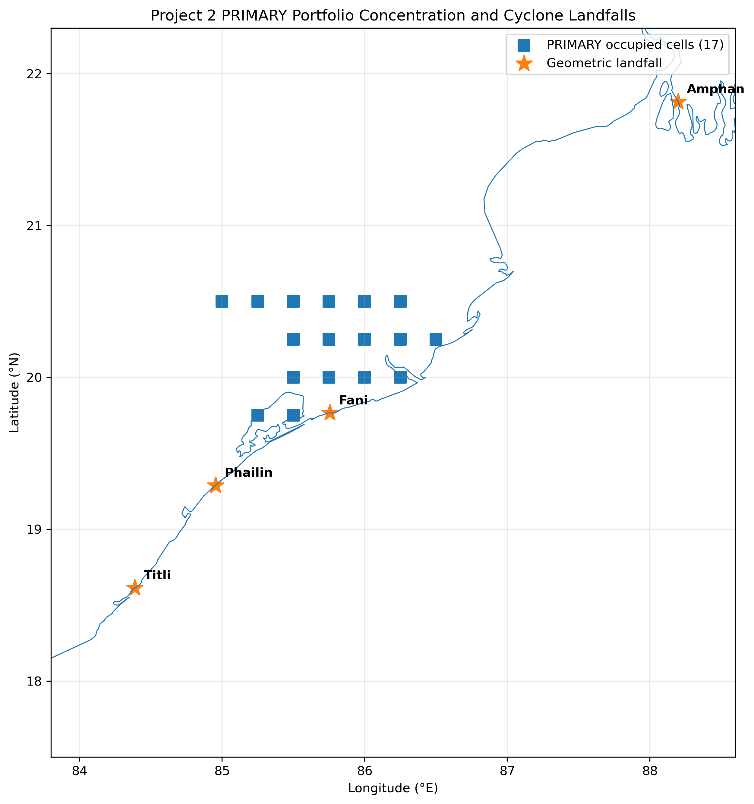
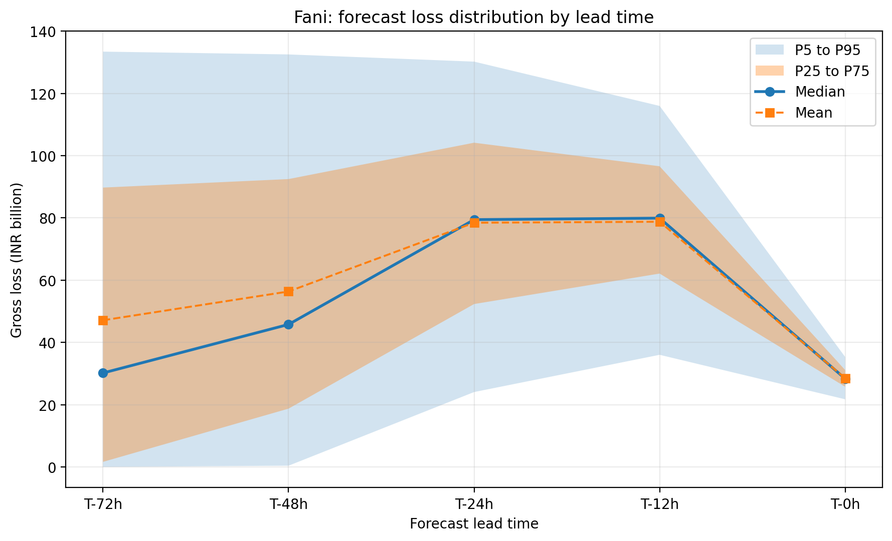
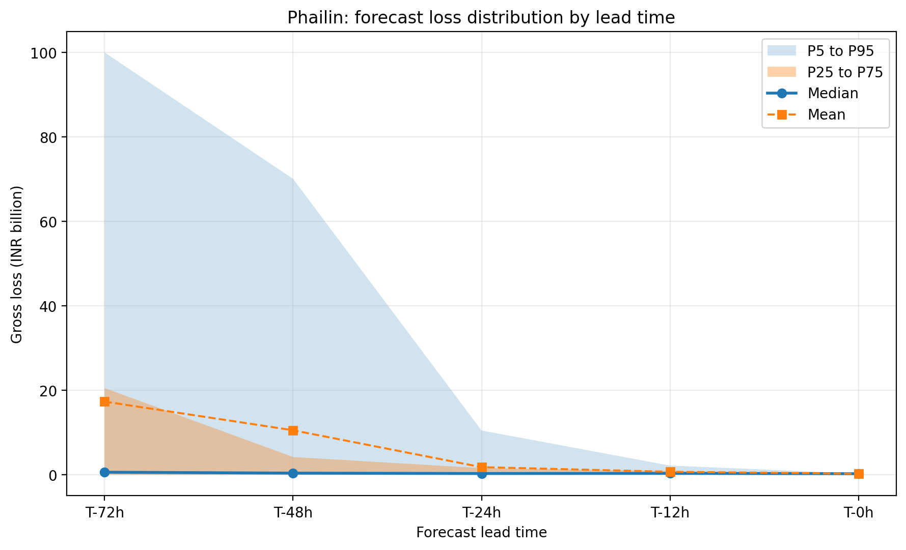
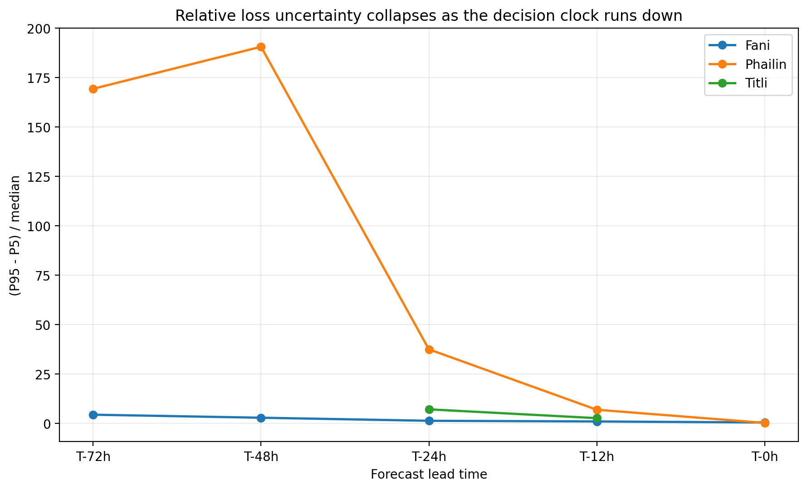
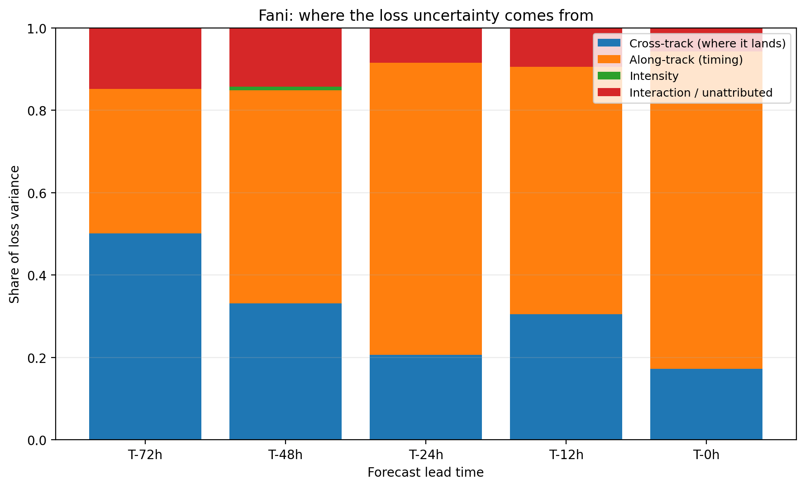
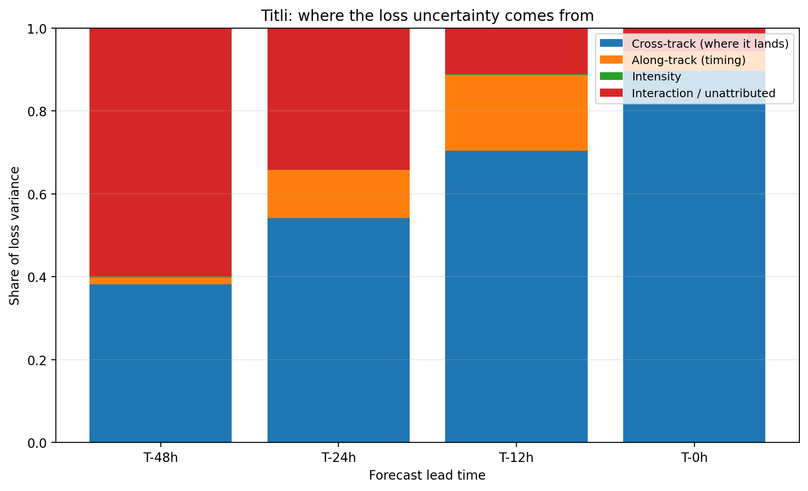
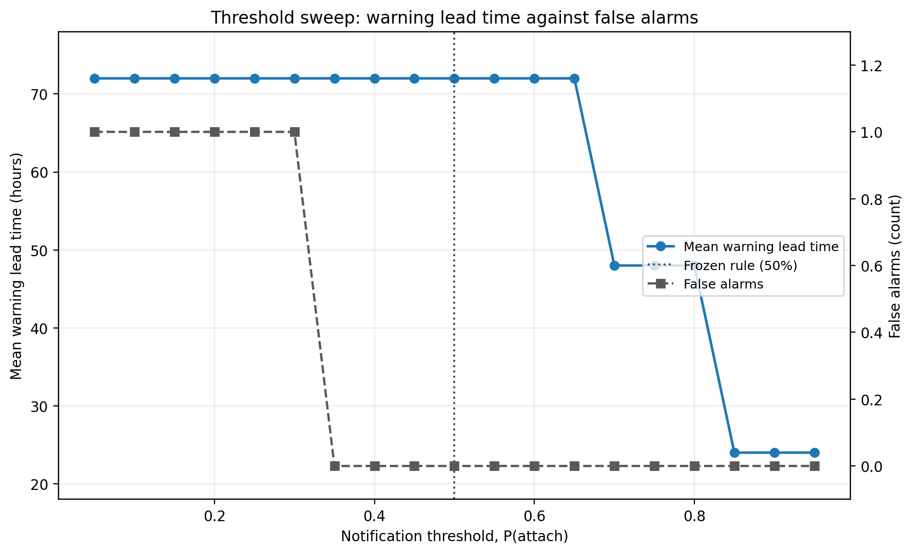

# Methodology

Full technical methodology for Project 3, Cyclone Event Response. The forecast error model has its own document, [`FORECAST_ERROR_MODEL.md`](FORECAST_ERROR_MODEL.md), which derives every error number with a provenance tag and holds the executable assertions that guard them. This document covers everything downstream of it, and the complete result tables that the README only summarises.

---

## 1. What the project is asking

A catastrophe model produces a view of risk over a year. An event response team has a different problem: a storm exists, it will make landfall in some number of hours, and decisions have to be made now that cannot be unmade. Reserve, notify the reinsurer, mobilise claims staff.

The question this project asks is what the forecast actually supported at each point on that clock. Not what the loss turned out to be, but what a team acting on the information available at T-72h, T-48h, T-24h and T-12h would have concluded, and how wrong they would have been.

That makes forecast error the object of study rather than a nuisance. Everything here flows from one modelling decision: perturb the historical best track by the published forecast error for the relevant lead time, run the resulting ensemble through a real catastrophe model, and read the decision layer off the loss distribution.

---

## 2. Landfall as a reproducible definition

### 2.1 Why it needed settling first

Every quantity in the project is indexed by hours before landfall. If landfall means something slightly different for each event, the panels stop being comparable and no ladder of forecast error applies consistently.

Three candidate definitions were tested:

| Option | Definition | Verdict |
|---|---|---|
| A | First sea-to-land crossing of the interpolated best track against a coastline dataset | **Adopted** |
| B | IMD's published landfall time, taken as stated | Rejected, event-dependent |
| C | Time of maximum intensity nearest the coast | Rejected, not a landfall |

Option B was rejected because IMD reports a window for some storms (Titli, Amphan) and a point for others, so adopting it would have made the rule depend on which event was being processed. Option C measures something else entirely.

### 2.2 The adopted definition

Landfall is the first transition from sea to land of the hourly-interpolated IBTrACS best track, tested against the Natural Earth 10m coastline, resolved to the minute by linear interpolation between the bracketing hourly positions.

| Event | SID | Landfall (UTC) | Latitude | Longitude | IMD reference | Offset |
|---|---|---|---|---|---|---|
| Fani | 2019116N02090 | 2019-05-03 03:51:27 | 19.765304 | 85.756775 | 2019-05-03 03:30:00 | -21 min |
| Phailin | 2013281N12098 | 2013-10-12 16:25:09 | 19.288445 | 84.954138 | 2013-10-12 17:00:00 | -35 min |
| Titli | 2018281N14088 | 2018-10-10 22:34:26 | 18.613110 | 84.388326 | 2018-10-10 23:30:00 | -56 min |
| Amphan | 2020136N10088 | 2020-05-20 10:42:54 | 21.814257 | 88.198464 | 2020-05-20 11:00:00 | -17 min |

**How the IMD reference was chosen.** IMD does not report landfall the same way
for every storm. Where it publishes a time *window*, the midpoint of that window
is taken; where it publishes a single time, that time is used directly. The rule
is uniform across the four events and does not depend on which storm is being
processed, which is the same property that disqualified Option B as a definition
in the first place. Fani's 03:30 reference, for example, is the midpoint of the
published 0230 to 0430 UTC window.

Note what the reference is for. It is **not** the landfall definition, and
nothing downstream reads it. It exists so that the geometric definition can be
checked against an independent authority, and a configuration self-check asserts
all four events fall within 60 minutes of it on every run. If a coastline dataset
change moved any event outside that bound, the run would fail rather than
proceeding quietly with a landfall point nobody had looked at.

The IBTrACS SIDs encode genesis, not landfall. Titli's `2018281N14088` is day 281
of 2018, 8 October, which is also when its best-track record begins and therefore
why its T-72h panel cannot exist (§6.1).

### 2.3 What this replaced

An earlier working definition placed Fani's landfall at 06:00 UTC, which put the landfall point 44 km inland at 20.2 N. Phailin's earlier reference was 16:00 UTC against IMD's ~1700 UTC. Every result derived from those was discarded, and the two scripts that encoded them were deleted rather than kept for reference, because a superseded landfall definition sitting in a repo is a defect waiting to be re-imported.

---

## 3. From IMD statistics to a sampler

Covered in full in [`FORECAST_ERROR_MODEL.md`](FORECAST_ERROR_MODEL.md). The three points that matter downstream:

**3.1 Dimension-aware conversion.** Direct position error is the mean magnitude of a 2-D error vector, which under an isotropic Gaussian is Rayleigh-distributed, so σ = DPE × √(2/π) = 0.798 × DPE. Landfall point error is a 1-D displacement along the coast, which is half-normal, so σ_c = LPE × √(π/2) = 1.253 × LPE. The two factors are reciprocal and differ by 36%. Applying the wrong one produces a table that looks entirely reasonable.

**3.2 Anisotropy derived, not assumed.** Published DPE and LPE at the same lead are two constraints on two unknowns, σ_a and σ_c, through the Hoyt (Nakagami-q) magnitude distribution. Solved numerically with Gauss-Legendre angular quadrature:

| Lead | DPE (km) | n | LPE (km) | n | σ_a (km) | σ_c (km) | σ_a/σ_c |
|---|---|---|---|---|---|---|---|
| 0 h | 5.00 (assumed) | - | 5.00 (assumed) | - | 3.99 | 3.99 | 1.00 |
| 12 h | 44.87 | 398 | 10.53 | 24 | 52.40 | 13.20 | 3.97 |
| 24 h | 71.97 | 332 | 16.19 | 23 | 84.47 | 20.29 | 4.16 |
| 48 h | 110.94 | 236 | 39.32 | 19 | 120.25 | 49.28 | 2.44 |
| 72 h | 154.03 | 135 | 69.52 | 10 | 154.00 | 87.13 | 1.77 |
| 96 h | 182.70 | 55 | not published | - | rejected | rejected | - |
| 120 h | 245.23 | 28 | not published | - | rejected | rejected | - |

The anisotropy is strongly lead-dependent and peaks at 24h. Along-track error is timing error; cross-track error is landfall placement. A 24-hour forecast knows where a storm will come ashore four times better than it knows when.

**3.3 Intensity from RMSE, not MAE.** The sampler needs a second-moment width. At 12h, MAE is 3.384 kt and RMSE is 4.961 kt, a factor of 1.47, and the gap widens with lead. Using MAE would understate the intensity tail at exactly the leads where the loss fan is widest.

---

## 4. Ensemble construction

### 4.1 The persistent-deviate scheme

Each member m draws three standard normal deviates **once** and carries them across the whole forecast:

```
z_a, z_c, z_v  ~  N(0,1), drawn once per member

for each forecast horizon h in [0, T]:
    along(h)  = sigma_a(h) * z_a
    cross(h)  = sigma_c(h) * z_c
    dv(h)     = sigma_v(h) * z_v
    displace the best-track position at h by (along, cross) in the track frame
```

Correlation between a member's offsets at any two horizons is exactly 1, and the displacement magnitude grows as σ grows along the forecast. This is what forecast error looks like: a member is consistently left or right of forecast, consistently early or late, and the error widens with range.

The rejected alternative draws independently at each horizon. That produces members that wander across the forecast corridor, crossing the best track repeatedly, which reproduces the marginal spread at each lead and nothing about the structure. A track that is 80 km left at 48h and 80 km right at 24h is not a forecast error, it is noise.

### 4.2 σ at the forecast origin is not zero

At h = 0 the storm's position is known from analysis, not forecast, but analysis is not exact. σ(0) is the T-0 value, 3.99 km, in both directions. Setting it to zero would make the ensemble a pencil at the origin fanning outward, which implies the analysis is perfect.

This is also why T-0 is isotropic while every other lead is not. **Anisotropy is a property of forecast error.** The along-track and cross-track split exists because a forecast is better at placing a storm across its path than along it. Analysis uncertainty is uncertainty about where the centre is right now and has no preferred direction. Applying the 12h anisotropy ratio to T-0 would have been applying a forecast property to a non-forecast.

An assertion checks σ(0) against the T-0 value at both ends, and separately checks that σ grows from the origin to landfall. Non-decreasing alone is not enough, because a rigid translation with σ frozen at the landfall value satisfies it, and that is one of the two failure modes this scheme can have.

### 4.3 The track frame, and the lever-arm artefact

The along and cross offsets have to be applied in a frame defined by the direction of motion. Three modes were implemented:

| Mode | Definition | Phailin T-72h rejections | Max implied speed |
|---|---|---|---|
| `local` | instantaneous heading at each point | **144 of 500** | 407 km/h |
| `smoothed` | centred circular mean over 6 h | intermediate | intermediate |
| `landfall` | the heading on approach to landfall, applied to all points | **0 of 500** | 24 km/h |

`landfall` is the default. The problem with `local` is geometric: where the track turns, the frame rotates between successive points, so a member with a large constant along-track deviate gets swung about a lever arm. Two adjacent displaced positions can end up far apart even though the underlying best-track positions are an hour of travel apart, and the physical plausibility screen correctly rejects the result.

This was diagnosed empirically rather than argued. Phailin's T-72h approach has the sharpest curvature in the set, 144 of 500 members failed the translation-speed screen, and switching the frame took it to zero.

With the post-landfall extension (section 5) the frame is anchored on the **landfall index**, not on the last point of the array. The last point is now well inland on a decaying and often turning track, and using its heading would rotate the frame for every member in every panel, including the ones the extension was not needed for.

### 4.4 Plausibility screen

Members are rejected if any position is non-finite, any latitude exceeds 89°, any intensity falls below the floor, or any segment implies a translation speed above the maximum. Screening covers the forecast window only. The post-landfall extension is observed best-track data rigidly translated, so it has nothing to screen, and including it would reject nearly every member because inland decay drops best-track intensity towards the floor.

With the landfall frame, every panel accepts 500 of 500.

---

## 5. The post-landfall extension

### 5.1 The defect

The specification in section 4.1 places each member at horizons 0 to T, where T is landfall. Implemented literally, the ensemble track array ends at landfall. A member with a large negative `z_a` is displaced backward along track, so at the final horizon it is still at sea, and CLIMADA computes a wind field that never comes ashore. The loss is exactly zero.

In a loss file that zero is identical to the zero produced by a member that made landfall 200 km from the portfolio. One is a statement about forecast uncertainty. The other is a statement about the length of an array.

### 5.2 How it was found

Not by an assertion. The fourteen assertions in `generate_ensemble.py` all passed, because every one of them tests a property of the ensemble at or before landfall and the ensemble was correct there.

It was found by asking a different question: 31% of Fani's T-72h members produced exactly zero loss, and the explanation offered for that was a cross-track miss. Cross-track displacement does not depend on `z_a` at all, so under that explanation the zero-loss set must be symmetric in `z_a`. Reconstructing the latent draws from the seed, which Stage 7 already does, and testing the sign balance gave 1.000 on four panels and 11 to 14 σ deviations on eight.

The lesson is narrow and worth stating: the assertions tested whether the sampler produced the specified distribution, and it did. They could not test whether the specification was adequate for what came next.

### 5.3 The fix

Each ensemble track continues past landfall along the real best track, by enough **path length** to cover `EXTENSION_SIGMAS = 4.0` times σ_a at landfall. Sizing in path length rather than hours matters: a slowly moving storm needs more hours to cover the same ground, and sizing in hours gets that backwards.

σ is held exactly constant across the extension, which makes the post-landfall segment a rigid translation of the real track by the member's landfall offset. That is what a persistent along-track error means physically: the storm arrives late, then follows its own path inland. The two alternatives are both wrong. Growing σ past landfall fabricates forecast error for a horizon the forecast was never verified at. Shrinking it pulls late members back towards the best track and quietly undoes the displacement being tested.

Four σ leaves about 3 draws in 100,000 uncovered on the backward side, so the expected number of truncated members at N = 500 is under 0.02 per panel.

### 5.4 Extension provided per panel

| Event | Lead | σ_a (km) | 4σ required (km) | Provided (km) | Hours | Covered |
|---|---|---|---|---|---|---|
| Fani | 72 | 154.00 | 616.0 | 640.6 | 24 | yes |
| Fani | 48 | 120.25 | 481.0 | 491.9 | 19 | yes |
| Fani | 24 | 84.47 | 337.9 | 345.1 | 14 | yes |
| Fani | 12 | 52.40 | 209.6 | 210.8 | 9 | yes |
| Phailin | 72 | 154.00 | 616.0 | **422.0** | 19 | **no** |
| Phailin | 48 | 120.25 | 481.0 | **422.0** | 19 | **no** |
| Phailin | 24 | 84.47 | 337.9 | 362.8 | 17 | yes |
| Phailin | 12 | 52.40 | 209.6 | 217.6 | 12 | yes |
| Titli | 48 | 120.25 | 481.0 | **388.2** | 31 | **no** |
| Titli | 24 | 84.47 | 337.9 | 352.9 | 29 | yes |
| Titli | 12 | 52.40 | 209.6 | 219.6 | 22 | yes |
| Amphan | 72 | 154.00 | 616.0 | **610.1** | 19 | **no** |
| Amphan | 48 | 120.25 | 481.0 | 512.8 | 16 | yes |
| Amphan | 24 | 84.47 | 337.9 | 354.2 | 11 | yes |
| Amphan | 12 | 52.40 | 209.6 | 220.8 | 7 | yes |

T-0 panels receive no extension: a single track point admits no along-track displacement, and all five T-0 panels had zero zero-loss members before and after.

All four shortfalls are at the end of the available best-track record. Phailin's record ends 19 h after landfall and Titli's 31 h. There is no longer extension to be had, so the shortfall is documented rather than chased.

### 5.5 Did the shortfall matter

The 4σ target is a design margin. What matters is whether any member **actually drawn** exceeded the extension, and that is tested per panel against the realised minimum of `z_a`:

| Panel | Extension | Worst backward draw | Members beyond | Zero-loss among them |
|---|---|---|---|---|
| Phailin T-72h | 422.0 km (2.74σ) | 462.7 km (3.00σ) | **1** | 1 |
| Phailin T-48h | 422.0 km (3.51σ) | 377.7 km (3.14σ) | 0 | 0 |
| Titli T-48h | 388.2 km (3.23σ) | 346.6 km (2.88σ) | 0 | 0 |
| Amphan T-72h | 610.1 km (3.96σ) | 550.0 km (3.57σ) | 0 | 0 |
| all 11 others | ≥ 4.02σ | ≤ 4.25σ | 0 | 0 |

**One member of 500, in one panel of fifteen.** Its effect is bounded: Phailin T-72h's zero fraction of 0.314 should be 0.312, a shift of 0.002 against a Monte Carlo standard error of 0.021; its attachment probability is understated by at most 0.002; and because that member could have contributed anywhere from zero to the panel maximum of ₹136.3B, the reported mean of ₹17.30B is understated by at most 1.6%.

Note that Phailin T-24h was covered by a margin of only 3.8 km and Fani T-12h by 9.3 km. The realised worst draw ranges from 2.58σ to 4.25σ across panels, because each panel has its own seed and so its own extreme value. Sizing against 4σ rather than against the observed draw is what made those two panels pass.

### 5.6 Effect of the fix

| Panel | zeros before | zeros after | frac z_a < 0 before | after |
|---|---|---|---|---|
| Fani T-72h | 154 | 53 | 0.948 | 0.868 |
| Fani T-48h | 137 | 15 | 1.000 | - |
| Fani T-24h | 50 | 1 | 1.000 | - |
| Fani T-12h | 27 | 0 | 1.000 | - |
| Phailin T-72h | 237 | 157 | 0.882 | 0.822 |
| Phailin T-48h | 227 | 136 | 0.916 | 0.860 |
| Phailin T-24h | 195 | 121 | 0.990 | 0.983 |
| Phailin T-12h | 131 | 36 | 1.000 | 1.000 |
| Titli T-48h | 343 | 306 | 0.589 | 0.552 |
| Titli T-24h | 336 | 267 | 0.679 | 0.629 |
| Titli T-12h | 311 | 229 | 0.582 | 0.581 |
| Titli T-0h | 149 | 149 | 0.631 | 0.631 |
| Amphan T-72h | 420 | 421 | 0.479 | 0.468 |
| Amphan T-48h | 479 | 477 | 0.516 | 0.514 |

Titli T-0h is unchanged in every digit because it is a T-0 panel and received no extension. The same holds for all five T-0 panels across the whole pipeline, which is the cleanest available evidence that the change touched only what it was supposed to.

### 5.7 Why the sign test is a screen and not a verdict

The residual one-sidedness is real and it is not truncation. Along-track displacement is a physical displacement, so where a storm's direction of motion points towards or away from the exposure, forward and backward shifts have genuinely different loss consequences.

Phailin made landfall at 19.288 N, 84.954 E moving northwest, up the coast towards the exposure block. A forward along-track shift carries it closer to the block; a backward shift carries it southeast and out to sea. Its zero-loss members are therefore one-sided in `z_a` for geometric reasons, and `frac = 1.000` at T-12h over 36 zeros is the correct answer.

The unconfounded test is section 5.5: extension length against realised draw. The sign test remains useful as a cheap screen that will fire if the extension is ever removed or shortened, and `validate_ensemble` now refuses any positive-lead panel that has no extension at all.

---

## 6. Hazard

CLIMADA `TropCyclone.from_tracks` with the Holland 2008 parametric wind field, on Project 1's exact 525-cell grid.

| Property | Value |
|---|---|
| Grid | 525 cells, bounds 82.0–88.0 E, 17.0–22.0 N, EPSG:4326 |
| Distance-to-coast | WGS84 geodesic to Natural Earth 10m, computed locally |
| Panels | 19 |
| Wind fields | 9,500 |
| Runtime | 11.2 s per panel, ~5.6 min total |
| Example (Fani T-12h) | max wind 69.19 m/s, 116,448 of 262,500 entries non-zero |

Project 1 bypassed CLIMADA's NASA distance-to-coast dependency after an HTTP 403 and computed distances independently against Natural Earth. Project 3 keeps that approach so the grids are identical and the pipeline has no external download dependency. The nearest coastline segment is selected using planar distance on unprojected coordinates and the distance to it is then computed geodesically, which is why GeoPandas emits a warning per centroid. The returned distance is correct; the segment choice is approximate and the two agree at these latitudes.

The physical reference track supplying `central_pressure`, `environmental_pressure` and `radius_max_wind` is built on the same time axis as the ensemble, passed through from one place rather than derived twice, because `to_climada_tctracks` compares the two timestamp arrays for exact equality and independently derived grids are how they come to disagree.

### 6.1 Track availability is a result

| Event | Best track begins | Landfall | History available |
|---|---|---|---|
| Fani | 2019-04-25 18:00 | 2019-05-03 03:51 | 177.9 h |
| Phailin | 2013-10-07 12:00 | 2013-10-12 16:25 | 124.4 h |
| **Titli** | 2018-10-08 00:00 | 2018-10-10 22:34 | **70.6 h** |
| Amphan | 2020-05-15 06:00 | 2020-05-20 10:42 | 124.7 h |

Titli's T-72h forecast origin is 2018-10-07 22:34, which is 1.43 h before IBTrACS first classifies the system. Asking what the 72-hour forecast was is asking what the forecast was for a storm that did not yet exist.

Two policies were implemented. `clamp` moves the origin forward to the first available track time and runs at the shorter actual lead. `skip`, the default, reports the panel unavailable with its shortfall recorded. Clamping was rejected because Titli's "T-72h" would really be T-70.6h, so the panels would stop being comparable and the landfall calibration assertion would have no ladder entry to check against.

The panel is recorded in `outputs/track_availability.csv` with its reason. A panel that is simply absent looks like a run someone forgot; a panel that is absent and recorded with its reason is a finding about when the decision clock starts for that storm.

---

## 7. Exposure and the grid join

Project 2's portfolio is 5,000 synthetic point locations. Project 1's hazard is a 525-cell grid. The join aggregates TIV from points to cells, which is the only place the two exposure representations touch and is what makes the three projects one system.

| Scenario | TIV | Occupied cells |
|---|---|---|
| **PRIMARY** | **₹145.684B** | **17 of 525** |
| P003_SENSITIVITY | ₹829.722B | 17 |
| P001_SENSITIVITY | ₹1,462.261B | 17 |
| COMBINED_SENSITIVITY | ₹1,462.261B | 17 |
| DIRTY | ₹1,465.404B | 18 |

PRIMARY is the modelling basis. All five are carried through Stage 4 in the same invocation, which matters: running PRIMARY now and the variants later would leave Stage 7 comparing loss files generated from different ensembles with no way to notice.

Exposure that falls outside the grid is excluded and counted rather than snapped to the nearest cell. Mislocated exposure cannot be modelled on a grid that does not cover it, and silently relocating it would turn a data-quality problem into a hazard result.

### 7.1 The footprint, and what it does to the results

17 of 525 cells are occupied and they form a block, not a coastal strip, because Project 2 generated its locations uniformly inside a rectangle. A per-cell diagnostic on Phailin at T-0h makes the consequence concrete: of 525 cells, exactly **2** carry loss above ₹1,000, both at latitude 19.750, at distances of about 60 km and 77 km from Phailin's landfall point. Loss in the nearer cell is 4.77 times the further one, a factor of five for 17 km of distance, which is the steep flank of the vulnerability curve.



*Figure M1. The 17 occupied cells and the four landfall points. The block occupies roughly 85.0 to 86.5 E and 19.75 to 20.5 N, with only the southern row near the coastline, so most of the portfolio sits inland of the shore the storms cross.*

Fani makes landfall at 19.765 N, 85.757 E, roughly 26.0 km from the nearest occupied cell and closer to the block than any other event in the set. Phailin lands 60 km southwest of the nearest occupied cell, Titli further south again, Amphan far to the northeast. The event set therefore spans direct strike to clean miss, which is the spread a trigger backtest needs, and the spread is a property of the rectangle as much as of the storms.

---

## 8. Loss and the reinsurance layer

Project 1's Odisha OSDMA vulnerability curve, impact function id 2, a 12-point mean damage ratio curve against 1-minute sustained wind. A point-by-point regression against the Project 1 implementation runs on every Stage 4 invocation and must pass. Re-deriving or substituting the curve would have made Project 3 losses incomparable with Project 1's and would have undermined the layer rescaling below.

### 8.1 Rescaling the layer rather than copying it

Project 1 prices **$10B xs $12B on a $144.86B** LitPop economic exposure base, in USD. Project 3 computes losses in rupees on a **₹145.684B** insured portfolio. The layer is rescaled to the same share of exposure:

```
attachment share = 12.00 / 144.86 = 8.284%   ->  0.08284 x 145.684B = Rs 12.07B
limit share      = 10.00 / 144.86 = 6.903%   ->  0.06903 x 145.684B = Rs 10.06B
quoted, rounded                               ->  Rs 10B xs Rs 12B
```

The derivation is written out in `config.py`, with the unrounded figures retained, for one specific reason: **144.86 and 145.684 are within 0.6% of each other and are different currencies measuring different things.** A reader who sees `ATTACHMENT = 12e9` in a rupee pipeline next to Project 1's `$12B xs` has no way to tell a share-based rescaling from a currency copy-paste error, because both produce approximately the same number. The arithmetic has to be visible.

### 8.2 Decision rules, frozen in advance

| Rule | Value | Rationale |
|---|---|---|
| Reserve | P75 of gross loss | a reserve is a prudent central estimate, not a mean |
| Notification | P(attach) ≥ 0.50 | notify when breach is more likely than not |
| Recovery | min(max(L - A, 0), Limit) | standard excess-of-loss |

Fixed in `config.py` before any loss was computed. Stage 8's sweep later showed 0.50 sits mid-plateau on the range over which the trigger is perfect on this sample, which is a validation of a pre-registered choice rather than a fitted threshold.

---

## 9. Results

### 9.1 Loss distribution, all panels

All figures in ₹B. 500 members per panel.

| Event | Lead | p_zero | p5 | p25 | p50 | p75 | p95 | mean | max |
|---|---|---|---|---|---|---|---|---|---|
| Fani | 72 | 0.106 | 0.00 | 1.63 | 30.17 | 89.74 | 133.42 | 47.11 | 140.44 |
| Fani | 48 | 0.030 | 0.39 | 18.72 | 45.77 | 92.47 | 132.52 | 56.36 | 140.28 |
| Fani | 24 | 0.002 | 24.05 | 52.33 | 79.43 | 104.16 | 130.21 | 78.45 | 138.63 |
| Fani | 12 | 0.000 | 36.02 | 62.12 | 79.93 | 96.59 | 115.97 | 78.76 | 129.18 |
| Fani | 0 | 0.000 | 21.73 | 25.75 | 28.34 | 31.11 | 35.32 | 28.49 | 44.12 |
| Phailin | 72 | 0.314 | 0.00 | 0.00 | 0.59 | 20.51 | 99.98 | 17.30 | 135.91 |
| Phailin | 48 | 0.272 | 0.00 | 0.00 | 0.37 | 4.18 | 70.05 | 10.52 | 136.35 |
| Phailin | 24 | 0.242 | 0.00 | 0.02 | 0.28 | 1.55 | 10.46 | 1.78 | 34.34 |
| Phailin | 12 | 0.072 | 0.00 | 0.18 | 0.31 | 0.89 | 2.16 | 0.69 | 12.99 |
| Phailin | 0 | 0.000 | 0.204 | 0.224 | 0.234 | 0.247 | 0.267 | 0.235 | 0.320 |
| Titli | 48 | 0.612 | 0.00 | 0.00 | 0.00 | 0.149 | 2.37 | 0.64 | 23.25 |
| Titli | 24 | 0.534 | 0.00 | 0.00 | 0.00 | 0.120 | 0.186 | 0.059 | 0.915 |
| Titli | 12 | 0.458 | 0.00 | 0.00 | 0.025 | 0.122 | 0.176 | 0.061 | 0.323 |
| Titli | 0 | 0.298 | 0.00 | 0.00 | 0.035 | 0.069 | 0.095 | 0.039 | 0.114 |
| Amphan | 72 | 0.842 | 0.00 | 0.00 | 0.00 | 0.00 | 2.88 | 1.04 | 70.15 |
| Amphan | 48 | 0.954 | 0.00 | 0.00 | 0.00 | 0.00 | 0.00 | 0.023 | 1.35 |
| Amphan | 24, 12, 0 | 1.000 | 0 | 0 | 0 | 0 | 0 | 0 | 0 |



*Figure M2. Fani, the event that struck. The central estimate is non-monotone in lead time, peaking at T-24h and T-12h.*



*Figure M3. Phailin, the near miss. The P5 to P95 band spans ₹0 to ₹100B at T-72h and collapses to ₹0.063B at T-0h, a factor of 1,581. The median is near zero throughout, which is why the relative width metric is unstable for this event.*

**Loss saturates near ₹140B regardless of which storm reaches the block.** Fani tops out at 140.44, Phailin at 136.35. The ceiling is set by the portfolio, not the event: once a perturbed track crosses the 17 occupied cells centrally, nearly everything is written off. Titli never reaches the block even at σ_c = 49 km, topping out at 23.25; Amphan reaches it only partially, at 70.15.

That ceiling is **96.4% of the ₹145.684B portfolio**, which is the clearest single symptom of the inherited calibration problem. See limitations in the README.

### 9.2 Uncertainty collapse

| Event | p95-p5 at T-72h | at T-0h | absolute collapse | monotone | relative collapse | monotone |
|---|---|---|---|---|---|---|
| Fani | ₹133.42B | ₹13.60B | 9.81x | yes | 9.22x | yes |
| Phailin | ₹99.98B | ₹0.063B | 1581x | yes | 627x | **no** |
| Titli | ₹2.37B (T-48h) | ₹0.095B | 25.0x | yes | 2.67x | yes |
| Amphan | ₹2.88B | 0 | undefined | yes | undefined | - |



*Figure M4. Relative width, (P95 - P5) divided by the median. Phailin peaks at T-48h rather than T-72h because its median is ₹0.37B there, which is the instability described above rather than a convergence failure. Titli appears only from T-24h and Amphan not at all, because a zero median makes the ratio undefined. Absolute width collapses monotonically for all four events.*

Phailin's relative width is non-monotone because it peaks at T-48h (190.7) rather than T-72h (169.4). That is not a convergence failure. Relative width divides by a median that is ₹0.37B at T-48h, so the ratio is unstable wherever most members sit near zero. Absolute width collapses monotonically for all four events. `p_zero_loss` belongs next to the width columns for exactly this reason.

### 9.3 Decision layer

| Event | Lead | Reserve P75 | P(attach) | n attach | P(exhaust) | Notify | Mean recovery |
|---|---|---|---|---|---|---|---|
| Fani | 72 | ₹89.74B | 0.658 | 329 | 0.562 | **yes** | ₹6.06B |
| Fani | 48 | ₹92.47B | 0.808 | 404 | 0.726 | yes | ₹7.68B |
| Fani | 24 | ₹104.16B | 0.976 | 488 | 0.956 | yes | ₹9.66B |
| Fani | 12 | ₹96.59B | 0.996 | 498 | 0.980 | yes | ₹9.89B |
| Fani | 0 | ₹31.11B | 1.000 | 500 | 0.946 | yes | ₹9.91B |
| Phailin | 72 | ₹20.51B | 0.308 | 154 | 0.244 | no | ₹2.77B |
| Phailin | 48 | ₹4.18B | 0.194 | 97 | 0.136 | no | ₹1.57B |
| Phailin | 24 | ₹1.55B | 0.044 | 22 | 0.010 | no | ₹0.26B |
| Phailin | 12 | ₹0.89B | 0.002 | 1 | 0.000 | no | ₹0.002B |
| Phailin | 0 | ₹0.25B | 0.000 | 0 | 0.000 | no | 0 |
| Titli | 48 | ₹0.149B | 0.016 | 8 | 0.004 | no | ₹0.09B |
| Titli | 24, 12, 0 | ≤₹0.12B | 0.000 | 0 | 0.000 | no | 0 |
| Amphan | 72 | 0 | 0.026 | 13 | 0.020 | no | ₹0.24B |
| Amphan | 48–0 | 0 | 0.000 | 0 | 0.000 | no | 0 |

Note Phailin's exhaustion probability of 0.244 at T-72h. A quarter of members not only breached the ₹12B attachment but burned through the full ₹10B limit, for a storm that in the event caused ₹0.235B of modelled loss. The T-72h forecast could not exclude a full-limit event for a storm that produced 0.2% of the attachment point.

### 9.4 Variance decomposition

Bias-corrected ω², with the unattributed interaction residual.

| Event | Lead | along (timing) | cross (placement) | intensity | interaction residual |
|---|---|---|---|---|---|
| Fani | 72 | 0.350 | **0.501** | 0.000 | 0.148 |
| Fani | 48 | **0.518** | 0.331 | 0.008 | 0.143 |
| Fani | 24 | **0.708** | 0.207 | 0.000 | 0.085 |
| Fani | 12 | **0.600** | 0.305 | 0.000 | 0.095 |
| Fani | 0 | **0.770** | 0.173 | 0.000 | 0.057 |
| Phailin | 72 | **0.368** | 0.279 | 0.000 | 0.353 |
| Phailin | 48 | **0.405** | 0.302 | 0.000 | 0.293 |
| Phailin | 24 | **0.387** | 0.107 | 0.002 | 0.504 |
| Phailin | 12 | **0.277** | 0.272 | 0.000 | 0.450 |
| Phailin | 0 | **0.606** | 0.378 | 0.006 | 0.009 |
| Titli | 48 | 0.016 | **0.382** | 0.002 | 0.600 |
| Titli | 24 | 0.116 | **0.541** | 0.000 | 0.342 |
| Titli | 12 | 0.183 | **0.704** | 0.002 | 0.111 |
| Titli | 0 | 0.047 | **0.896** | 0.000 | 0.057 |
| Amphan | 72 | 0.005 | **0.296** | 0.000 | 0.699 |
| Amphan | 48 | 0.000 | **0.330** | 0.000 | 0.670 |



*Figure M5. Fani. Cross-track dominates at T-72h and along-track from T-48h inward. Intensity is the thin green sliver, never above 1% of variance. The unattributed interaction share stays between 6% and 15%.*



*Figure M6. Titli. Cross-track dominates at every lead, rising to 90% at T-0h, because a storm this far from the portfolio can only reach it through a large cross-track displacement. The contrast with Fani is the track-to-portfolio geometry, not a difference in the sampler.*

Three findings.

**Intensity forecast error contributes essentially nothing.** The largest intensity ω² anywhere is 0.008, and the largest η² is 0.031. Relative to track position error, how strong the storm is barely matters to this portfolio's loss. The caveat is that loss here is dominated by whether the footprint intersects 17 cells at all, which is a geometry question; a spatially extensive portfolio would weight intensity far more heavily.

**Interaction dominates for marginal events.** First-order indices explain 85 to 95% of the variance for the direct hit and under half for Phailin at T-24h and T-12h, Titli at T-48h, and Amphan throughout. For a near-miss, loss depends on the joint position rather than on either component, and no first-order decomposition can recover that. That is a statement about the limits of variance decomposition in event response, and it is more informative than a clean attribution would have been.

**Which component dominates is set by geometry, not by which σ is larger.** σ_a exceeds σ_c at every positive lead, by up to a factor of 4.16, yet cross-track dominates for Titli and Amphan and along-track for Phailin and for Fani below T-72h.

### 9.5 The anisotropy check did not confirm what it was built to confirm

`anisotropy_cross_check.csv` was written to test a hypothesis: that cross-track error should dominate loss variance despite being the smaller displacement, because loss cares where a storm hits rather than when. It confirms on 7 of 16 panels and fails on 9.

| Confirms | Fails |
|---|---|
| Titli T-48, T-24, T-12, T-0 | Fani T-48, T-24, T-12, T-0 |
| Amphan T-72, T-48 | Phailin T-72, T-48, T-24, T-12, T-0 |
| Fani T-72 | |

The hypothesis was wrong as a general claim, and the check is measuring something real that was mislabelled. Whether along-track or cross-track dominates depends on the angle between the track and the bearing to the exposure, and on whether the event is a direct hit or a marginal one. Phailin's track runs northwest up the coast towards the block, so along-track displacement is effectively distance-to-portfolio for that storm. Amphan and Titli are far enough away that only a large cross-track draw brings them into range at all, which the data shows directly: Amphan's loss-producing members have mean |z_c| of 2.03 against 0.64 for its zero-loss members.

It is retained and reported as a **track-geometry diagnostic** rather than as a validation. The same geometry explains the residual one-sidedness of the zero-loss sets in section 5.7, so the two results corroborate each other.

### 9.6 Trigger backtest

| Threshold | Warned hits | Missed | False alarms | Correct silences | Warning lead |
|---|---|---|---|---|---|
| 0.05 – 0.30 | 1 | 0 | **1** (Phailin) | 2 | 72 h |
| **0.35 – 0.65** | **1** | **0** | **0** | **3** | **72 h** |
| 0.70 – 0.80 | 1 | 0 | 0 | 3 | 48 h |
| 0.85 – 0.95 | 1 | 0 | 0 | 3 | 24 h |



*Figure M7. The sweep. Hit detection is flat at 1.0 across the whole range because there is one hit, which is itself the limitation: this figure cannot distinguish a good threshold from a lucky one on four events.*

The plateau from 0.35 to 0.65 is perfect on this sample and gives the full 72 hours of warning the experiment covers. Below 0.35 Phailin becomes a false alarm; above 0.65 warning lead starts to erode. The frozen 0.50 rule sits in the middle.

Whipsaw: Fani fires at T-72h and never stops firing. No event fires and then un-fires at any threshold. A trigger that oscillates is worse than a late one, because an event response team cannot un-mobilise.

**One hit and three misses is not a backtest.** The plateau is a property of this four-event sample and nothing more.

---

## 10. Process corrections

Each of these changed a number that had already been computed and reported.

| # | What was wrong | How it was caught | Effect |
|---|---|---|---|
| 1 | Post-landfall truncation: tracks ended at landfall, so backward-displaced members never reached the coast | sign test on `z_a` among zero-loss members, 11–14 σ | zeros overstated, P(attach) understated at every lead, along-track variance share inflated; whole pipeline regenerated |
| 2 | Dropped Jacobian factor in the Hoyt angular integral | equal-σ Rayleigh-limit assertion; first noticed as a physically implausible 30 km/h implied speed | σ_a inflated ~25% |
| 3 | Along-track width as √(DPE² - LPE²) on published means | expected magnitudes do not combine in quadrature, only variances do | replaced with joint numerical calibration |
| 4 | Persistence assertion compared `c1*z_a` against `c2*z_a`, which is 1 by algebra | mutation test: a deliberately broken sampler passed it | replaced with three checks through the real code path |
| 5 | T-0 had no sampler at all (σ_a = σ_c = None) | one of five scenarios had no defined width | filled isotropically at 3.99 km, with the reasoning recorded |
| 6 | `local` track frame produced a lever-arm artefact | 144 of 500 Phailin T-72h members at 407 km/h | frame anchored on landfall heading, 0 of 500 |
| 7 | T-0 landfall assertion compared a 2-D analysis uncertainty against the cross component | expected 5.0 km from a quantity whose mean is 3.19 km | made dimension-aware |
| 8 | Fani landfall at 06:00 UTC, 44 km inland | compared against IMD's 0230–0430 UTC window | geometric definition adopted, all four events re-derived |
| 9 | `EVENT_HIT_PORTFOLIO` keyed on landfall geography | wrong test for a 17-cell book | derived from the T-0 median loss against the attachment point |
| 10 | Stage 5 and 6 read hardcoded Fani and Phailin filenames | failed on the other two events | event-aware throughout |
| 11 | Stage 7 hardcoded exposure variant names | did not match the generated ones | replaced with glob discovery |
| 12 | `None` to `NaN` coercion made a notification flag fire at `T-nan` h | the flag fired and stayed fired | explicit `pd.notna()` |
| 13 | Zero loss variance reported as "100% unattributed" | degenerate panels | flagged `degenerate` rather than attributed |
| 14 | Stage 4 exited non-zero for a legitimately unavailable panel, stopping the pipeline | Titli T-72h halted a full run | unavailability now exits 0, which is what `track_availability.py` always said it was |

---

## 11. Assertion inventory

Assertions are preferred to diagnostics wherever the property can be stated, because a diagnostic has to be read and an assertion does not.

**Stage 1, error model.** Twelve assertions on provenance, sample-weighted means against IMD's published figures, pooled RMSE in squared-error space, ladder monotonicity, the Rayleigh and half-normal conversions, and the equal-σ reduction of the anisotropic solver.

**Stage 2, ensemble.** Persistence of offsets through the sampler; σ anchored to the T-0 value at the origin and to the ladder at landfall; σ strictly growing over the forecast window and exactly constant over the extension; ensemble mean position unbiased within 4 Monte Carlo standard errors; sampled landfall spread against published LPE within 3 SE, dimension-aware by lead; sampled total position spread against published DPE within 3 SE; geodesic round trip recovering each applied offset; extension length against the largest backward draw; refusal of any positive-lead panel with no extension.

**Stage 3, hazard.** Grid is exactly 525 cells in EPSG:4326; distance-to-coast finite and non-negative for all centroids; hazard matrix shape 500 × 525; all intensities finite; maximum wind positive; interpolated landfall endpoint within tolerance of the canonical table.

**Stage 4, loss.** Impact function regression against Project 1 point by point; member index a permutation of 0 to N-1 in order; off-grid exposure counted and excluded rather than relocated.

**Stage 6, decision layer.** Reported probability equals count divided by members, so a probability can never disagree with its own count.

**Stage 7, decomposition.** Generator source inspected to confirm the latent draw order has not changed, because Stage 7 joins losses to draws by index and a reordered draw would still produce a plausible decomposition of the wrong variables.

**Configuration.** All four landfall times within 60 minutes of the IMD reference; output directories present; the CAT XL share derivation recomputed from its inputs rather than hardcoded.

Every Monte Carlo tolerance is derived from N. A tolerance chosen as a round number is how a correct sampler gets debugged for a day.

---

## 12. What would change the conclusions

In rough order of how much.

1. **A coast-following exposure portfolio.** The footprint is the largest single artefact in the project, and fixing it would bring Phailin and Titli into range.
2. **Calibrated absolute loss.** Until then, only the relative results stand.
3. **More events.** Four events and one portfolio hit cannot support a threshold recommendation.
4. **Surge.** Would change which events matter, not just how much they cost.
5. **Per-event forecast error** instead of a climatological ladder.
